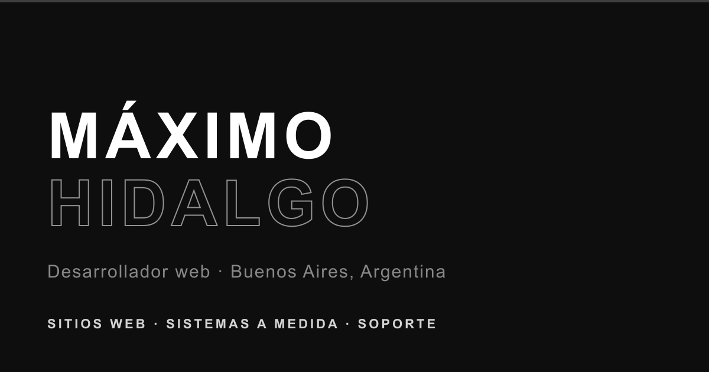

<a href="https://portfolio-maximo-hidalgo.vercel.app">
  
</a>

# Portfolio de Maximo Hidalgo

Mi sitio personal, donde muestro los proyectos en los que trabajé, mi experiencia y lo que hago como desarrollador web en Buenos Aires.

**Ver en vivo:** [portfolio-maximo-hidalgo.vercel.app](https://portfolio-maximo-hidalgo.vercel.app)

## Qué hay en el sitio

- **Proyectos:** cada uno con su página de caso, contando qué se necesitaba, qué hice y cómo quedó. Entre ellos, el sistema de control de acceso por DNI para la Asociación del Fútbol Argentino (AFA) y la app Al Toque!
- **Experiencia y formación:** mi recorrido laboral y de estudio.
- **Servicios:** sitios web, landing pages, sistemas a medida y soporte técnico.
- **Contacto:** mail, WhatsApp, LinkedIn y mi CV para descargar.

## Cómo está hecho

Lo armé con HTML, CSS y JavaScript, sin frameworks ni build step, para que cargue rápido y sea fácil de mantener. Las animaciones usan [GSAP](https://gsap.com) y el sitio está publicado en [Vercel](https://vercel.com).

```
├── index.html                    Página principal
├── proyectos.html                Todos los proyectos
├── caso-control-acceso-dni.html  Caso: control de acceso para la AFA
├── caso-al-toque.html            Caso: app Al Toque!
├── css/                          Estilos
├── js/                           Animaciones e interacciones
└── assets/                       Imágenes, CV y favicon
```

Para verlo localmente alcanza con abrir `index.html` en el navegador, o levantar un servidor simple:

```bash
npx serve .
```

## Contacto

- Mail: [maxihidalgo04@gmail.com](mailto:maxihidalgo04@gmail.com)
- LinkedIn: [linkedin.com/in/maximohidalgoo](https://www.linkedin.com/in/maximohidalgoo)
